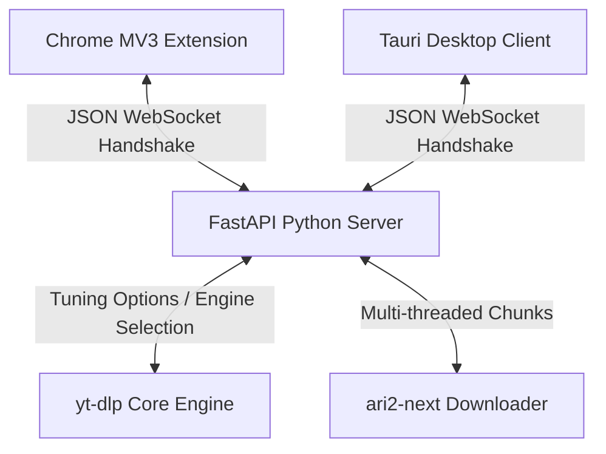

# DownloadAnything 🚀

A premium, high-performance media downloader client and browser extension ecosystem powered by **FastAPI**, **yt-dlp**, **Tauri**, and **React**. 

DownloadAnything allows you to seamlessly intercept, analyze, and download high-resolution streams (including 1080p, 1440p, and 4K) from YouTube, Twitter, Vimeo, and hundreds of other platforms directly to custom directory presets.

---

## 🏗️ Project Architecture



### 1. The Desktop Client (Tauri + React + Vite + TypeScript)
- **Dashboard**: Track active, paused, completed, and failed downloads with high-frequency speed and ETA ticks.
- **Unified Settings Hub**: A single, structured tab with dedicated panels for **General Preferences**, **Preset Paths**, **Downloader Engines**, and **Browser Extensions**.
- **Interactive Prober**: Analyze pasted media URLs to select precise format container options before queuing downloads.

### 3. The Backend Server (FastAPI + Python)
- **High-Performance Metadata Parsing**: Resolves format metadata in 1-2 seconds by leveraging `check_formats: "cached"`, client targeting (`android`/`web`), and updating directly without remote GitHub scraping overhead.
- **Resilient Multi-Phase Progress Manager**: Performs live stream-phase tracking for split video/audio feeds, merging progress cleanly without status jumps.
- **Ari2-Next Integration**: Configurable multi-threaded downloading with aggressive split connection rules.

### 4. The Browser Extension (Manifest V3)
- **Persistent Socket Life**: Uses a hidden `chrome.offscreen` document to host the WebSocket connection, ensuring Chrome doesn't interrupt active tracking when the Service Worker suspends.
- **Direct HTML Injector**: Renders native overlay buttons above detected video frames to send media targets directly to the local server.
- **Sanitized DOM Insertion**: Fully protected against DOM XSS vectors via native sanitization helpers.

---

## ⚡ Getting Started

### Prerequisites
You need the following installed on your machine:
- **Node.js** (v18+)
- **Python** (v3.10+)
- **FFmpeg** (registered in System PATH or configured via Custom Settings)
- **aria2c** (Optional, for multi-threaded chunk downloads)

### 1. Running the Backend Service
From the workspace root, navigate to the server and boot the FastAPI gateway:
```bash
# Install dependencies
pip install -r requirements.txt

# Run the backend (defaults to http://127.0.0.1:8765)
python server/app/main.py
```

### 2. Launching the Desktop Client
In a new terminal window, boot the Tauri app dev environment:
```bash
# Install node dependencies
npm install

# Run tauri in development mode
npm run tauri:dev
```

### 3. Installing the Chrome Extension
1. Open Google Chrome and go to `chrome://extensions/`.
2. Toggle **Developer mode** in the top-right corner.
3. Click **Load unpacked** and select the `/extension` directory inside this project workspace.

---

## ⚙️ Configuration & Tuning

Under the **Settings** menu in the desktop application, you can fully adjust down-stream behaviors:
- **Output Preferences**: Specify default container merges (`MKV` or `MP4`) and enable automated cookie loading from active browser profiles (Chrome, Brave, Safari, Edge, Firefox).
- **Core Downloader Tuning**: Manage concurrent fragment downloads, network retries, and rate limits.
- **Ari2-Next Connection Rules**: Toggle the `ari2-next` downloader to enable parallel chunk splits (up to 32 connections) for maximum throughput.
- **Preset Folders**: Map custom folders (e.g. `Movies`, `Music`) to automatically route downloads on selection.